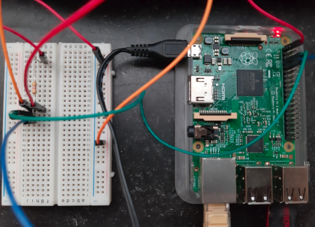

# raspi-temperature

This repo contains instructions and scripts to setup a DS1820 temperatur sensor on a Raspberry Pi Model B using docker, influxdb and grafana for visualization.

The original instructions I followed almost 10 years ago can be found [here](https://www.kompf.de/weather/pionewiremini.html) - some part, especially the python part to read the temperatur from the sensor, is still taken from there.

However, the setup has been revised in 2022 to A) move the deployment to docker containers and B) to use [InfluxDB](https://www.influxdata.com/) as a time-series database (instead of a round-robin-database) and [Grafana](https://www.influxdata.com/) for visualizing the captured temperature data.

Note: As I found out during this project, the last version of InfluxDB to work with `armv7l` is 1.8. Whereas InfluxDB >= 2 provides a web-interface including visualization of the data, this is not the case so Grafana as a visualization tool is required here.

The setup consists of three docker container:

* tempmanager: with python 3.6 (miniconda) installed and mounting `/sys/bus/w1/devices` into the container in order to be able to caputure the temperature
* influxdb: running on port 8086 for storing the time series data
* grafana: running on port 3000 for visualizing the temperature data

A prerequisite for this instruction is to know how to initially install raspbian and how to connect to your raspberry via ssh - there are lots of tutorials out there in the www covering these aspects. Furthermore, docker is expected to be installed on the raspberry as well. The raspberry pi should also be available in your network.

These instructions do not cover any aspects of IT security.

## Setup: Temperature Sensor

The temperatur sensor DS1820 is to be connected as follows:

* green cable: connect DQ of sensor (pin 2) with GPIO4-interface of Raspberry (pin 7)
* blue cable: connect GND of sensor (pin 1) to GND-interface of Raspberry (pin 9)
* red cable: connect VDD of sensor (pin 3) to 3V3-interface of Raspberry (pin 1)
* orange / red cables: connect 4,7 kOhm resistance between 3V3-interface of Raspberry (pin 1) and DQ of sensor (pin 2)

<div class="row justify-content-center">



</div>

To configure the temperature sensor on the raspberry, you can run the script [`setup_raspberry.sh`](setup_raspberry.sh) (be sure to have admin privileges for the user that is running the script):

```bash
./setup_raspberry.sh
```

The script configures the required modules on the raspberry for the temperature sensor and configures everything to be setup when booting the system. The script also triggers a reboot at the end.(This script must be executed only once for the initial setup.)

When the system has been rebooted, you read the temperature from the sensor. For our containerized setup, a environment variable `TEMP_SENSOR_ID` is set with the distinct ID of the connected hardware. To do so, you can run the script [`config_sensor.sh`](config_sensor.sh):

```bash
./config_sensor.sh
```

If everything works fine, you should see the ID of your sensor printed to the console as well as the current temperatur. The environment variable `TEMP_SENSOR_ID` with the appropriate value is appended to the file [`.env`](.env). (This script must be executed only once for the initial setup.)

More detailed instructions on the configuration of the sensor can also be found [here](https://www.kompf.de/weather/pionewiremini.html).

## Setup: Docker

To create the dockerized framework, run [`setup_docker.sh`](setup_docker.sh):

```bash
./setup_docker.sh
```

This script builds the container `tempmanager`, which is used to execute the python script [`tempmanager/read_temp-sensor.py`](tempmanager/read_temp-sensor.py). This script reads the temperatur from the host system every 60 seconds and writes to the InfluxDB in the database in the influxdb-container. Furthermore, the script also performs the initial setup of the influxdb container.


## Usage

Finally, to start the whole container framework, run

```bash
docker-compose up -d
./start.sh
```

For the first setup of Grafana, you can access the Grafana web-interface with http://ip-of-your-raspberry:3000. The initial credentials are "admin:admin". Upon first login you are asked to change the password.

Go to "Configurartion > Data Sources" and add a new data source. Select "InfluxDB":

<div class="row justify-content-center">


</div>

Then create an new "Dashboard > Add new panel". Select the "Data Source > InfluxDB" and switch to the "raw-query-mode". Enter the query `SELECT "pi-temperature" FROM "temperature"` and execute it by refreshing the panel:


Save the dashboard and you are ready to monitor the temperature, captured by your raspberry pi.


